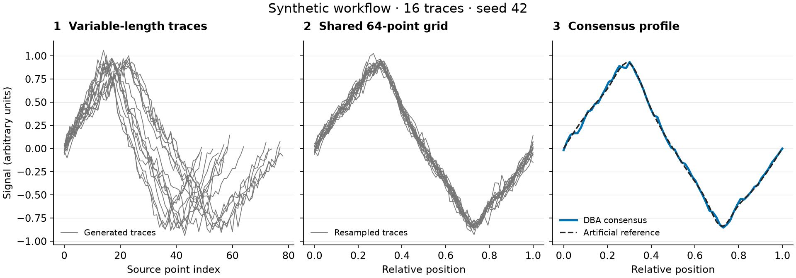

# Nanopore signal analysis

[](https://github.com/jennylaijiang-lgtm/nanopore-signal-analysis/actions/workflows/checks.yml)

Selected Python implementations for nanopore signal processing, alignment and consensus analysis.

Nanopore recordings of the same molecule can differ in duration and noise. This project explores how to put those signals on comparable axes, estimate a consensus profile, and assess how preprocessing choices affect peptide-variant classification.

I developed the uncertainty-weighted consensus and length-normalisation implementations below during my research project in the Cees Dekker Lab at TU Delft, supervised by Dr Xiuqi Chen. The accompanying analyses examine preprocessing, boundary transfer and sensitivity to consensus initialisation.

## Code to inspect

| Start here | What it demonstrates |
| --- | --- |
| **[DBA consensus](cowler/consensus/dba.py)** | My implementation from an existing documented scaffold: inverse-variance weighting, medoid initialisation, convergence tracking and read-depth accounting. |
| **[Length normalisation](cowler/consensus/length_normalize.py)** | My numerical preprocessing implementation: variance interpolation, training-derived target lengths and input validation. |
| **[Boundary evaluation](scripts/evaluate_boundary_constructs.py)** | A compact research runner comparing within-construct fits with a frozen model transferred across constructs. |

For a deeper analysis example, see **[preprocessing ablation](scripts/evaluate_psk_preprocessing_ablation.py)**: eight conditions, frozen training/test labels and common-cohort comparisons. The [other research runners](scripts/) cover consensus classification and the complete staged medoid-robustness analysis.

## Try it with generated signals



The example illustrates the workflow using artificial signals in arbitrary units; it is not a physical nanopore simulation or evidence of experimental accuracy. All 16 traces are shown. The final panel compares the consensus with the known artificial reference, without an uncertainty band or a claim of large improvement. [Figure details and source data](docs/synthetic-example.md).

With Python 3.11+ (tested locally with 3.12), run from the repository root:

```bash
python3 -m venv .venv
source .venv/bin/activate
python -m pip install -e '.[demo]'
python -m examples.synthetic_consensus
```

On Windows, activate with `.venv\Scripts\Activate.ps1`. Outputs in `results/synthetic/` include the figure, trace/consensus CSVs and a summary with convergence and both medoid and consensus RMSE. The first run may take longer while Numba compiles DTW.

## Scope and attribution

Experimental data and calibration tables are **not included**. Research runners require external inputs; see [experimental setup and checks](docs/experimental-runners.md). The consensus is a signal profile, not an amino-acid sequence. Evaluations using upstream filtering remain test-informed and should not be read as independent biological validation.

The underlying DTW implementation was written primarily by Dr Xiuqi Chen. Supporting code and portfolio assistance are identified in [Contributions](CONTRIBUTIONS.md). No open-source licence has been added.
